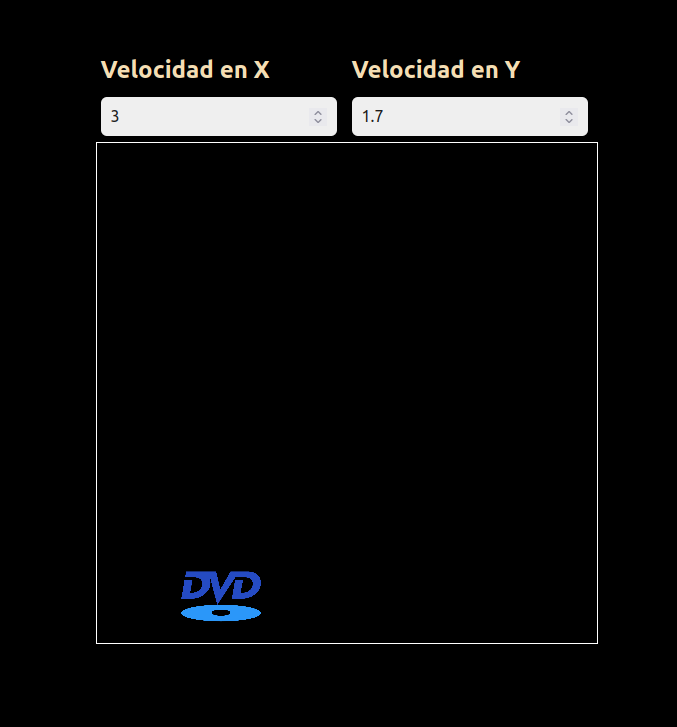

# DVD Player Simulator

Welcome to the DVD Player Simulator, a creative and interactive project that brings the classic DVD player screen to life in your browser. This project is designed to mimic the refresh screen that DVD players display after a period of inactivity, providing a nostalgic experience for users. Additionally, it introduces a unique feature that allows users to control the movement of the DVD image on the screen by adjusting the `velocidadX` and `velocidadY` values.

## Features

- **DVD Player Screen Simulation**: Recreate the DVD player's refresh screen in your browser.
- **Interactive Controls**: Adjust the inputs to control the velocity of the DVD image.
- **Responsive Design**: Optimized for various screen sizes to ensure a smooth experience across devices.

## Getting Started

To get started with the DVD Player Simulator, follow these simple steps:

1. **Clone the Repository**: Use `git clone` to clone this repository to your local machine.
2. **Open the HTML File**: Navigate to the project directory and open the `index.html` file in your browser.
3. **Adjust the Velocities**: Use the inputs to adjust the velocity values. Watch as the DVD image moves across the screen.

## Contributing

Contributions are welcome! If you have a feature request, bug report, or want to improve the project, please feel free to open an issue or submit a pull request.

## Screenshots

## Acknowledgments

- Inspiration from classic DVD players and their refresh screens.
- Appreciation for the open-source community and the power of JavaScript.

## License

This project is licensed under the MIT License.
